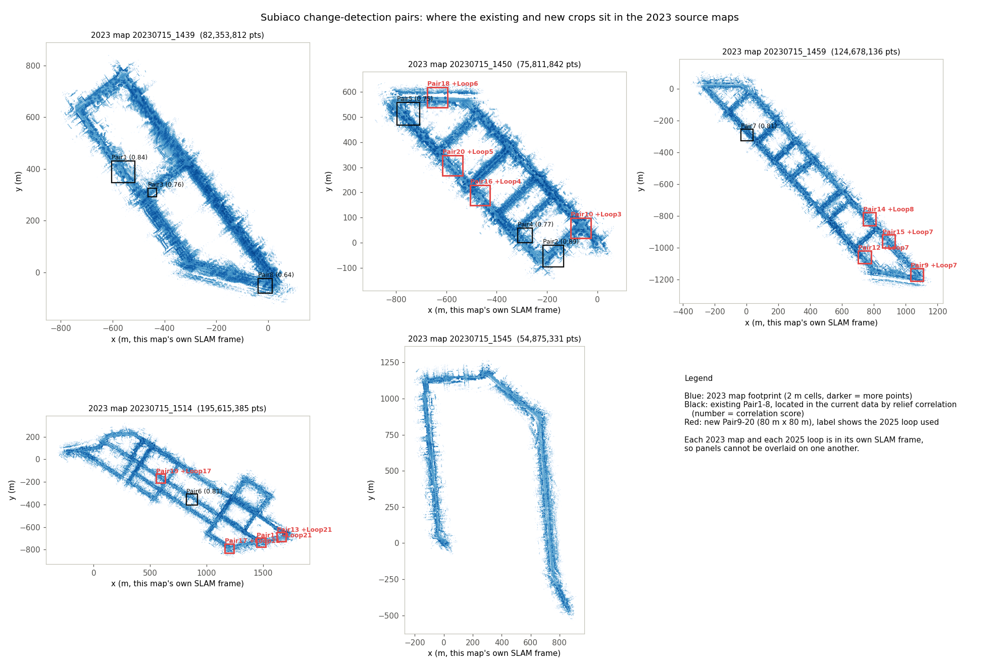
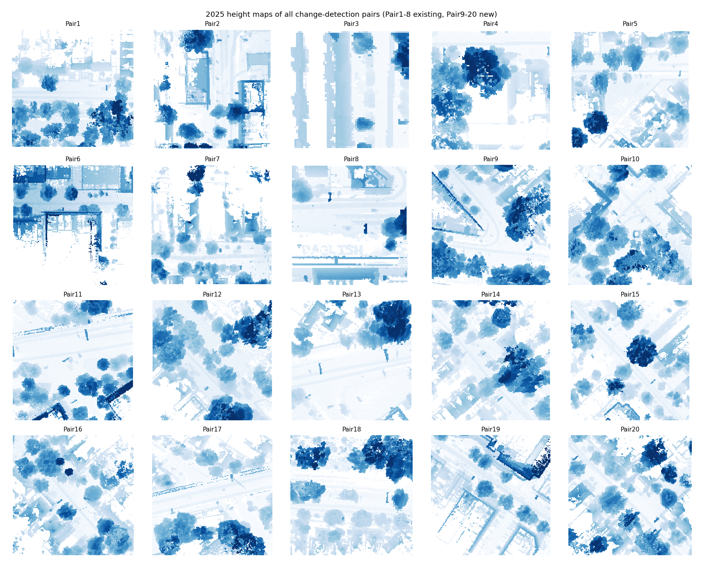

# LiDAR-based 3D Change Detection at City Scale

[](https://huggingface.co/datasets/ibrahim80876/Change-Detection-LiDAR-Dataset)
[](https://ieee-dataport.org/documents/2023-subiaco-wa-3d-hd-lidar-point-cloud-maps-dataset)
[](https://ieee-dataport.org/documents/2025-subiaco-wa-3d-hd-lidar-gnss-point-cloud-maps-dataset)
[](https://www.python.org/)
[](LICENSE)
[](https://creativecommons.org/licenses/by/4.0/)

Official code and data links for the paper

> **LiDAR-based 3D Change Detection at City Scale**
> Hezam Albaqami, Haitian Wang, Xinyu Wang, Muhammad Ibrahim, Zainy M. Malakan, Abdullah M. Algamdi, Mohammed H. Alghamdi and Ajmal Mian
> *Scientific Reports* (under review, 2026)

This repository contains the Python scripts used to prepare the bi-temporal Subiaco point-cloud pairs, to run the uncertainty-aware, object-centric change-detection pipeline, and to compute the evaluation tables reported in the paper. The processed change-detection pairs are hosted on Hugging Face and the full city-scale source maps on IEEE DataPort.

---

## Contents

1. [Overview](#overview)
2. [Repository structure](#repository-structure)
3. [Data](#data)
4. [Installation](#installation)
5. [Method and scripts](#method-and-scripts)
6. [Usage](#usage)
7. [Evaluation protocol](#evaluation-protocol)
8. [Results](#results)
9. [Reproducing the paper tables](#reproducing-the-paper-tables)
10. [Citation](#citation)
11. [License](#license)
12. [Contact](#contact)

---

## Overview

High-definition 3D city maps enable city planning and change detection, which is essential for municipal compliance, map maintenance and asset monitoring of both built structures and urban greenery. Conventional Digital Surface Model (DSM) and image differencing are sensitive to vertical bias and viewpoint mismatch, while raw point-cloud or voxel models require large memory, assume perfect alignment and degrade thin structures.

We propose an **uncertainty-aware, object-centric method for city-scale LiDAR change detection**:

* **Calibrated registration.** The two epochs are aligned coarse-to-fine with multi-resolution Normal Distributions Transform (NDT) followed by point-to-plane Iterative Closest Point (ICP) with a Tukey biweight kernel. Both maps are levelled and height-normalised.
* **Per-point level of detection (LoD).** A 95 % level of detection is computed from the registration covariance (ICP Hessian) and the local surface roughness of both epochs. It gates every change decision so that registration residuals are not misread as change.
* **Semantic and instance segmentation.** An unsupervised geometric segmentation assigns the classes *ground, building, vegetation, mobile* and produces class-consistent instances.
* **Class-constrained bipartite assignment.** Geometry-based associations are refined per class with a Hungarian assignment on an augmented cost matrix whose dummy rows and columns handle split–merge, *Added* and *Removed* cases.
* **Tiled, object-level decisions.** The city is processed in 80 m × 80 m tiles with 10 m overlap to bound memory and preserve narrow ground changes. Each instance pair is labelled *Added, Removed, Increased, Decreased* or *Unchanged* from overlap, displacement, height and volumetric statistics under local LoD gating, with a logistic confidence score.

The method is validated on the city of Subiaco (Western Australia), surveyed with mobile LiDAR in July 2023 and again in February 2025. Across all 20 loops it reaches **95.3 % accuracy, 90.8 % macro F1 and 82.9 % macro IoU**. On the held-out test loops it improves over the strongest learning-based baseline, Triplet KPConv, by 0.6, 1.8 and 2.1 points respectively, without any training data.

<p align="center">
  
  <br><em>Location of the 20 paired areas inside the five 2023 source maps (black: Pair1 to Pair8, red: Pair9 to Pair20).</em>
</p>

<p align="center">
  
  <br><em>Top-down height maps of the aligned 2023 and 2025 crops and their height difference for every pair.</em>
</p>

---

## Repository structure

```
.
├── README.md
├── LICENSE
├── CITATION.cff
├── requirements.txt
│
├── adaptive_point_cloud_segmentation.py          # noise removal, ground extraction, adaptive DBSCAN instances
├── city_point_cloud_segmentation.py              # density-adaptive ground / object segmentation with export
├── point_cloud_diff.py                           # object matching and XY-coverage differencing between two epochs
├── Registration based result.py                  # geometric pipeline: ICP refinement, LoD95, gated change detection,
│                                                 #   object layer, sensitivity sweeps and ablations on the pairs
├── ablation-studies-result.py                    # builds the sensitivity, segmentation and ablation tables (LaTeX)
├── export_intermediates_for_ablation studies.py  # exports per-loop and pooled confusion matrices and metrics (JSON)
│
├── CD Data-Preparation-scripts/                  # pipeline that produced Pair9 to Pair20 from the source maps
│   ├── inventory.py          # lists source files, point counts, sizes and coverage
│   ├── footprint.py          # streams a huge ASCII PLY into a 2 m occupancy grid
│   ├── pairwise_frames.py    # 2D rigid transform between every 2023 map and 2025 loop (relief NCC)
│   ├── locate_existing.py    # finds the manual pairs Pair1 to Pair8 inside the source maps
│   ├── analyse_pairs.py      # checks the original crops and their alignment transforms
│   ├── select_verify.py      # selects and verifies new 80 m x 80 m matching areas
│   ├── crop.py               # crops several XY boxes from one source file in a single pass
│   ├── align.py              # levels, centres and co-registers a 2023/2025 crop pair
│   ├── make_pairs.py         # driver: crop + align + pair_info.json for every selected box
│   ├── make_figures.py       # per-pair height maps and height-difference previews
│   └── overview2.py          # overview of the pair locations inside the 2023 source maps
│
└── Loops-figures/                                # preview figures for the 20 pairs
    ├── overview_maps.png
    ├── contact_sheet.png
    └── Pair1.png ... Pair20.png
```

---

## Data

### Source surveys (IEEE DataPort)

The full city-scale maps are published on IEEE DataPort:

| Survey | Capture date | Sensor | Source maps | Points | Link |
|---|---|---|---|---|---|
| 2023 | 15 July 2023 | Ouster OS1-64 (64 beams) | 5 SLAM maps | 533,334,506 | [2023 Subiaco WA 3D HD LiDAR Point Cloud Maps Dataset](https://ieee-dataport.org/documents/2023-subiaco-wa-3d-hd-lidar-point-cloud-maps-dataset) |
| 2025 | 26 February 2025 | Ouster OS1-128 (128 beams) | 20 SLAM loops + GNSS logs | 1,018,867,380 | [2025 Subiaco WA 3D HD LiDAR GNSS Point Cloud Maps Dataset](https://ieee-dataport.org/documents/2025-subiaco-wa-3d-hd-lidar-gnss-point-cloud-maps-dataset) |

The 2025 rig combines an Ouster OS1-128 LiDAR, a dual-antenna RTK GNSS receiver with a MEMS IMU and a logging unit. Twenty overlapping road loops cover arterial corridors, residential blocks and major intersections.

### Processed change-detection pairs (Hugging Face)

Twenty ready-to-use pairs of co-registered point clouds are hosted at
**https://huggingface.co/datasets/ibrahim80876/Change-Detection-LiDAR-Dataset** (CC BY 4.0, about 7 GB).

```
Change-Detection-LiDAR-Dataset/
├── data/
│   ├── Pair1/
│   │   ├── <2023 source map name> - Cloud.ply   # original 2023 crop, source-map frame
│   │   ├── <2025 source loop name> - Cloud.ply  # original 2025 crop, loop frame
│   │   ├── 2023.ply                             # levelled, centred, co-registered
│   │   ├── 2025.ply                             # levelled, centred, co-registered
│   │   └── pair_info.json                       # Pair9 to Pair20 only
│   └── ... Pair20/
├── scripts/      # the same data-preparation scripts as in CD Data-Preparation-scripts/
└── figures/      # the same previews as in Loops-figures/
```

* All point clouds are ASCII PLY files with the fields `x y z r g b`. Only the coordinates carry information; RGB is zero as in the source maps. Units are metres.
* `2023.ply` and `2025.ply` are levelled, centred on the pair area and co-registered, with the 2025 ground at z = 0.
* `pair_info.json` records the crop boxes in both frames, transforms, tilt angles, ICP results and alignment residuals.
* Pair numbers are area identifiers and do not correspond to survey loop numbers.

| Pair | 2023 source map | 2025 loop (capture time) | Crop size (m) | 2023 points | 2025 points | Method |
|---|---|---|---|---|---|---|
| Pair1 | 20230715_1439 | Loop3 (18:52) | 86 x 83 | 1,297,020 | 4,138,268 | Manual |
| Pair2 | 20230715_1450 | Loop4 (18:55) | 84 x 85 | 1,482,712 | 4,356,884 | Manual |
| Pair3 | 20230715_1439 | Loop3 (18:52) | 33 x 32 | 372,836 | 810,816 | Manual |
| Pair4 | 20230715_1450 | Loop4 (18:55) | 57 x 57 | 611,251 | 1,345,516 | Manual |
| Pair5 | 20230715_1450 | Loop6 (19:02) | 88 x 87 | 1,815,359 | 2,880,173 | Manual |
| Pair6 | 20230715_1514 | Loop17 (19:40) | 96 x 97 | 1,597,817 | 2,502,520 | Manual |
| Pair7 | 20230715_1459 | Loop17 (19:40) | 74 x 74 | 1,231,858 | 1,691,443 | Manual |
| Pair8 | 20230715_1439 | Loop1 (18:45) | 53 x 55 | 802,711 | 1,199,665 | Manual |
| Pair9 | 20230715_1459 | Loop7 (19:22) | 80 x 80 | 2,410,808 | 3,691,667 | Automated |
| Pair10 | 20230715_1450 | Loop3 (18:52) | 80 x 80 | 3,444,087 | 6,549,773 | Automated |
| Pair11 | 20230715_1514 | Loop21 (unknown) | 80 x 80 | 1,857,735 | 2,060,814 | Automated |
| Pair12 | 20230715_1459 | Loop7 (19:22) | 80 x 80 | 2,179,254 | 3,795,109 | Automated |
| Pair13 | 20230715_1514 | Loop21 (unknown) | 80 x 80 | 2,273,353 | 2,115,457 | Automated |
| Pair14 | 20230715_1459 | Loop8 (19:20) | 80 x 80 | 1,651,922 | 2,998,040 | Automated |
| Pair15 | 20230715_1459 | Loop7 (19:22) | 80 x 80 | 1,463,816 | 2,542,975 | Automated |
| Pair16 | 20230715_1450 | Loop4 (18:55) | 80 x 80 | 1,965,612 | 4,896,852 | Automated |
| Pair17 | 20230715_1514 | Loop21 (unknown) | 80 x 80 | 1,772,992 | 1,929,153 | Automated |
| Pair18 | 20230715_1450 | Loop6 (19:02) | 80 x 80 | 1,173,944 | 2,659,985 | Automated |
| Pair19 | 20230715_1514 | Loop17 (19:40) | 80 x 80 | 1,646,048 | 2,287,563 | Automated |
| Pair20 | 20230715_1450 | Loop5 (18:59) | 80 x 80 | 1,439,820 | 4,176,673 | Automated |

Pair1 to Pair8 were cropped in CloudCompare and levelled in Rhino 6. Pair9 to Pair20 were produced automatically with the scripts in `CD Data-Preparation-scripts/` (see [Data-preparation pipeline](#data-preparation-pipeline)). Alignment quality, measured as the median nearest-neighbour distance between the aligned clouds, is 0.08 to 0.15 m for the manual pairs (Pair6 about 0.5 m) and 0.15 to 0.30 m for the automated pairs. These figures include genuine change, vegetation and vehicles, so they are an upper bound on the registration error of static surfaces.

#### Download

Whole dataset with the Hugging Face CLI:

```bash
pip install -U huggingface_hub
hf download ibrahim80876/Change-Detection-LiDAR-Dataset --repo-type=dataset --local-dir ./subiaco_cd
```

A single pair from Python:

```python
from huggingface_hub import snapshot_download
import open3d as o3d

path = snapshot_download(
    repo_id="ibrahim80876/Change-Detection-LiDAR-Dataset",
    repo_type="dataset",
    allow_patterns=["data/Pair9/2023.ply", "data/Pair9/2025.ply", "data/Pair9/pair_info.json"],
)
pc_2023 = o3d.io.read_point_cloud(f"{path}/data/Pair9/2023.ply")
pc_2025 = o3d.io.read_point_cloud(f"{path}/data/Pair9/2025.ply")
print(pc_2023, pc_2025)
```

---

## Installation

The scripts are plain Python and were run on Windows and macOS. Python 3.9 or newer is recommended (Open3D wheels are published for Python 3.8 to 3.12).

```bash
git clone https://github.com/IbrahimUWA/LiDAR-3D-Change-Detection-City-Scale.git
cd LiDAR-3D-Change-Detection-City-Scale
python -m venv .venv
# Windows: .venv\Scripts\activate      Linux/macOS: source .venv/bin/activate
pip install -r requirements.txt
```

`requirements.txt` lists NumPy, SciPy, scikit-learn, Open3D, Matplotlib, pandas, Polars and `huggingface_hub`. Open3D is only needed by the three visualisation-oriented scripts (`adaptive_point_cloud_segmentation.py`, `city_point_cloud_segmentation.py`, `point_cloud_diff.py`). Polars is only needed by the streaming readers in `CD Data-Preparation-scripts/`.

---

## Method and scripts

The table maps the stages of the paper to the code in this repository.

| Paper stage | Script | What it does |
|---|---|---|
| Pair preparation from the city maps | `CD Data-Preparation-scripts/*.py` | Footprints, map-to-loop frame estimation, area selection and verification, cropping, levelling and co-registration, metadata and previews |
| Pre-processing (voxel pyramid, statistical outlier removal, normals) | `Registration based result.py` (`preprocess`) | Voxel down-sampling to a 0.25 m leaf, SOR (k = 20, 2.0 std), PCA normals in a 0.8 m radius with normal-direction roughness |
| Fine registration and registration uncertainty | `Registration based result.py` (`icp_point_to_plane`) | Point-to-plane ICP with Tukey biweight (tau = 0.3 m), Gauss–Newton updates, registration standard deviation from the final Hessian |
| Level of detection LoD95 | `Registration based result.py` (`lod_grid`, `change_detect`) | Per-point 95 % level of detection from the roughness of both epochs and the registration covariance |
| Height normalisation and ground extraction | `city_point_cloud_segmentation.py`, `adaptive_point_cloud_segmentation.py`, `point_cloud_diff.py` | RANSAC ground plane, below-ground removal, ground/non-ground split |
| Semantic and instance segmentation | `adaptive_point_cloud_segmentation.py`, `city_point_cloud_segmentation.py`, `Registration based result.py` (`unsup_semantics`) | Density-adaptive DBSCAN instances, geometric ground / building / vegetation / other split |
| Object association and change evidence | `point_cloud_diff.py`, `Registration based result.py` (`change_detect`) | Object matching on centroid, volume and point count; normal-direction displacement to the cross-epoch neighbour, LoD-gated flags, DBSCAN object layer |
| Sensitivity analysis and ablations | `Registration based result.py` (`main`) | One-at-a-time sweeps of SOR, normal radius, voxel leaf and LoD gate; variants without LoD gating, without the object layer, without SOR |
| Evaluation tables | `ablation-studies-result.py`, `export_intermediates_for_ablation studies.py` | Pooled confusion matrices, accuracy, macro F1, macro IoU, per-class IoU; LaTeX tables and JSON exports |

### Default parameters

| Parameter | Value | Where |
|---|---|---|
| Finest voxel leaf | 0.25 m | `DEFAULTS["leaf"]` |
| SOR neighbours k / std ratio | 20 / 2.0 | `DEFAULTS["sor_k"]`, `DEFAULTS["sor_std"]` |
| Normal estimation radius r_n | 0.8 m | `DEFAULTS["r_n"]` |
| RANSAC ground inlier threshold | 0.6 m | sensitivity table |
| ICP iterations / max correspondence / sample | 8 / 1.0 m / 200,000 points | `DEFAULTS["icp_*"]` |
| Tukey biweight tau | 0.3 m | `icp_point_to_plane` |
| LoD gate theta_LoD | 1.2 | `DEFAULTS["theta"]` |
| Object layer: DBSCAN eps / min samples / min object size | 1.0 m / 30 / 200 points | `DEFAULTS["dbscan_*"]`, `DEFAULTS["min_obj_pts"]` |
| Tile size / overlap | 80 m × 80 m / 10 m | paper, Results section |
| Change-analysis voxel | 0.5 m | paper, Change Analysis section |

---

## Usage

Several scripts carry the input and output paths used for the paper as constants near the top of the file or in the `__main__` block. Edit those constants (named below) before running.

### 1. Segmentation of a single epoch

Density-adaptive ground and object segmentation with optional export of each segment:

```bash
python city_point_cloud_segmentation.py path/to/2025.ply --output result.ply --visualize
```

`--output result.ply` writes `result_ground.ply`, one `result_object_<i>.ply` per instance and `result_colored.ply`. Instances with fewer than 400 points are treated as noise.

Fully adaptive segmentation with statistical and radius outlier removal, RANSAC ground fitting and two-stage DBSCAN (a 3D viewer opens after each step):

```bash
# set `filename` in the __main__ block, or call the function from Python
python adaptive_point_cloud_segmentation.py
```

```python
from adaptive_point_cloud_segmentation import adaptive_point_cloud_segmentation
ground, objects, clusters = adaptive_point_cloud_segmentation("data/Pair9/2025.ply", visualize=False)
```

### 2. Object-level differencing of two epochs

`point_cloud_diff.py` levels both clouds, removes the ground, clusters objects, matches them on centroid, volume and point count, and keeps the points of each matched object that have no XY counterpart in the other epoch. Red marks geometry present only in the first cloud, blue geometry present only in the second.

```python
from point_cloud_diff import main
diff_first_only, diff_second_only = main(
    "data/Pair9/2025.ply", "data/Pair9/2023.ply",
    voxel_size=1, eps=3, min_points=200, match_threshold=30,
    diff_threshold=0.1, xy_threshold=1.0, ground_distance=0.5,
    ransac_n=3, ransac_iterations=1000)
```

Alternatively set `point_cloud1` and `point_cloud2` in the `__main__` block and run `python point_cloud_diff.py`.

### 3. Registration, LoD-gated change detection, sensitivity and ablations

`Registration based result.py` is the headless implementation of the geometric pipeline. It reads the aligned pairs from a zip archive whose entries are `PairN/2023.ply` and `PairN/2025.ply`:

```bash
# from the Hugging Face download
cd subiaco_cd/data && zip -r ../Pairs.zip Pair* && cd ../..
```

Set the three constants at the top of the script and run it:

```python
ZIP_PATH = r"path/to/Pairs.zip"
OUT_DIR  = r"path/to/results"
PAIRS    = [f"Pair{i}" for i in range(1, 21)]   # the released configuration processes Pair1 to Pair8
```

```bash
python "Registration based result.py"
```

For every pair the script runs the default configuration, a one-at-a-time sensitivity sweep (`sor_k`, `sor_std`, `r_n`, `leaf`, `theta`) and the ablations `no_lod_gating`, `no_object_layer` and `no_sor`, and writes:

| Output | Content |
|---|---|
| `registration_lod_summary.csv` | ICP RMSE and inlier ratio, sigma_reg, median and 90th-percentile LoD95, flagged fractions, object counts, false-positive proxy on stable cells, runtime |
| `sensitivity_raw.csv` | the same statistics for every swept value plus the voxelised Jaccard agreement with the default change mask |
| `ablation_raw.csv` | the same statistics for every ablation variant |
| `segmentation_distribution.csv` | fraction of ground / building / vegetation / other points per pair |
| `change_maps/<Pair>_removed_2023.ply`, `change_maps/<Pair>_added_2025.ply` | binary PLY change maps (red = removed, green = added) |

Parsed point clouds are cached as `.npy` files next to the script, so re-runs are fast.

### 4. Evaluation tables

`ablation-studies-result.py` computes the sensitivity table, the segmentation-accuracy table and the ablation table from reference and predicted labels. It expects one folder per loop:

```
ROOT/
  loop01/ ... loop20/
    gt_change.npy        int in {0..4}: 0 Added, 1 Removed, 2 Increased, 3 Decreased, 4 Unchanged  (-1 = outside visibility mask)
    gt_sem.npy           int in {0..3}: 0 ground, 1 building, 2 vegetation, 3 mobile
    pred_sem.npy         predicted semantic label per point (same order as gt_sem)
    change/<run>.npy     predicted change label per evaluation unit, one file per run:
                         default, sor_k=10, sor_k=40, sor_std=1.0, sor_std=3.0, r_n=0.4, r_n=1.6,
                         ransac=0.3, ransac=1.2, leaf=0.15, leaf=0.5, theta=1.0, theta=1.5,
                         oracle_seg, perturb_10, perturb_20, perturb_30,
                         no_lod, no_class_assoc, no_semantic, pointwise
    sem/<run>.npy        (optional) predicted semantic labels for perturb_10/20/30
  runtime.csv            (optional) columns: run, seconds
```

```bash
python ablation-studies-result.py ROOT --check                    # validate the layout only
python ablation-studies-result.py ROOT --out TABLES_4_5_6.tex     # write the three LaTeX tables
```

`export_intermediates_for_ablation studies.py` exports every per-loop and pooled confusion matrix with TP/FP/FN, precision, recall, F1 and IoU per class to JSON and a Markdown summary. It can cross-check its numbers against the table script:

```bash
python "export_intermediates_for_ablation studies.py" ROOT --out intermediate_results --evaluator ablation-studies-result.py
```

### Data-preparation pipeline

The scripts in `CD Data-Preparation-scripts/` reproduce Pair9 to Pair20 from the IEEE DataPort source maps. Every 2023 map and every 2025 loop is in its own SLAM frame and tilted by 2 to 12 degrees, so a map-to-loop transform is estimated per area. Run the scripts from inside that folder, after setting the root paths (`R`, `ROOT`, `OUT`) to your copy of the source data:

| Step | Command | Output |
|---|---|---|
| 1. Inventory the source files | `python inventory.py` | `inventory.csv` |
| 2. Footprint every source cloud on a 2 m grid | `python footprint.py <source.ply> footprints/<name>.npz` | `footprints/*.npz` |
| 3. Estimate the 2D rigid transform between every 2023 map and 2025 loop | `python pairwise_frames.py [n_workers]` | `pairwise_frames.json` |
| 4. Locate the manual pairs in the source maps (optional) | `python locate_existing.py [Pair1 ...]`, `python analyse_pairs.py` | `existing_located.json`, `existing_pairs.json` |
| 5. Select and verify new 80 m x 80 m areas | `python select_verify.py [n_new]` | `selected.json` |
| 6. Crop and co-register | `python make_pairs.py all` (or `crop` / `align`) | `PairN/<source> - Cloud.ply`, `PairN/2023.ply`, `PairN/2025.ply`, `PairN/pair_info.json` |
| 7. Previews | `python make_figures.py [PairA ...]`, `python overview2.py` | `figures/PairN.png`, `figures/contact_sheet.png`, `figures/overview_maps.png` |

Selection accepts an area only when at least 60 % of its cells are covered in both epochs, each epoch has at least 300,000 points, it lies at least 130 m from other pairs, the relief normalised cross-correlation reaches 0.70 with a margin of 0.15 over the second-best peak, and it passes a flatness test against duplicated SLAM surfaces. Alignment levels each cloud with a RANSAC ground plane, centres it, applies a coarse shift from DSM cross-correlation and refines with trimmed ICP. `crop.py` and `align.py` can also be used stand-alone:

```bash
python crop.py boxes.json                          # boxes.json: list of {name, src, xmin, xmax, ymin, ymax, out}
python align.py raw2023.ply raw2025.ply out_dir    # writes out_dir/2023.ply, 2025.ply, alignment.json
```

---

## Evaluation protocol

* **Change labels (5 classes):** *Added, Removed, Increased, Decreased, Unchanged*, decided per object instance and rasterised on a 0.5 m grid for scoring.
* **Semantic labels (4 classes):** *ground, building, vegetation, mobile*. The segmentation is unsupervised; the manual annotations are used only for evaluation.
* **Metrics:** micro accuracy (ACC), macro F1 (mF1) and macro IoU (mIoU) over the five change labels, computed from the confusion matrix pooled over the selected loops, plus per-class IoU.
* **Partition:** the twenty survey loops are split into mutually exclusive training (loops 6 to 20) and test (loops 1 to 5) sets. The split exists only to train the learning-based baselines; our method uses the same fixed parameters on every loop and no training data. The ablation study and the baseline comparison use the test loops; the sensitivity and segmentation analyses use all twenty loops.

---

## Results

### Comparison with learning-based methods (held-out test loops 1 to 5)

| Method | Venue | ACC | mF1 | mIoU | Added | Removed | Increased | Decreased | Unchanged |
|---|---|---|---|---|---|---|---|---|---|
| DSM–Siamese | ICIP'18 | 92.1 | 73.9 | 58.3 | 69.4 | 54.2 | 29.7 | 46.1 | 92.1 |
| DSM–FC–EF | TGRS'19 | 92.2 | 72.7 | 57.2 | 68.7 | 52.3 | 27.9 | 43.5 | 93.6 |
| Siamese KPConv | ICCV'19 | 94.6 | 89.0 | 80.1 | 85.9 | 78.4 | 72.8 | 68.1 | 95.5 |
| Triplet KPConv | ISPRS'21 | 95.0 | 90.2 | 81.8 | 88.4 | 82.1 | 75.6 | 67.2 | 95.9 |
| DC3DCD EFSKPConv | ISPRS'25 | 92.0 | 74.1 | 58.9 | 69.1 | 53.2 | 31.0 | 47.2 | 93.9 |
| **Object-based (ours)** | – | **95.6** | **92.0** | **83.9** | **89.1** | **82.8** | **77.8** | **78.1** | **96.2** |

All values are percentages. The largest gain is on *Decreased* (narrow resurfacing and partial kerb overlap), where the IoU exceeds the nearest competitor by more than 10 points.

### All twenty loops

Aggregated over all loops the method reaches **95.3 % ACC, 90.8 % mF1 and 82.9 % mIoU**, with class IoUs of 87.5 (Added), 81.3 (Removed), 76.9 (Increased), 75.6 (Decreased) and 94.3 (Unchanged). Per-loop accuracy stays within 94.1 to 96.2 %, macro F1 within 88.6 to 92.3 % and macro IoU within 79.6 to 84.8 %.

### Ablation (test loops 1 to 5)

| Variant | ACC | mF1 | mIoU | Added | Removed | Increased | Decreased | Unchanged |
|---|---|---|---|---|---|---|---|---|
| **Full pipeline (ours)** | **95.6** | **92.0** | **83.9** | **89.1** | **82.8** | **77.8** | **78.1** | **96.2** |
| w/o LoD gating | 94.1 | 88.7 | 79.2 | 87.9 | 80.6 | 71.2 | 68.4 | 88.0 |
| w/o class-constrained association | 94.6 | 89.8 | 80.8 | 86.2 | 79.5 | 74.9 | 72.0 | 91.6 |
| w/o semantic/instance layer | 93.5 | 87.2 | 77.4 | 84.0 | 77.3 | 71.5 | 68.9 | 85.4 |
| w/o object-centric decisions (point-wise) | 92.8 | 85.9 | 75.3 | 81.5 | 74.2 | 68.0 | 64.6 | 88.2 |

Each component contributes. Object-centric reasoning is the largest single contributor, followed by LoD gating. The sensitivity analysis in the paper varies SOR neighbours (10 to 40), SOR standard-deviation ratio (1.0 to 3.0), normal radius (0.4 to 1.6 m), RANSAC threshold (0.3 to 1.2 m), voxel leaf (0.15 to 0.5 m) and LoD gate (1.0 to 1.5) one at a time; all-loop macro IoU stays within about two points of the default.

---

## Reproducing the paper tables

1. Download the processed pairs from Hugging Face (see [Download](#download)) or rebuild them from the IEEE DataPort maps with `CD Data-Preparation-scripts/`.
2. Run `Registration based result.py` on the pairs to obtain the registration statistics, LoD values, change maps, sensitivity sweep and ablation variants.
3. Rasterise the per-instance change decisions and the semantic labels of every loop onto the 0.5 m evaluation grid in the layout described in [Usage, step 4](#4-evaluation-tables).
4. Run `ablation-studies-result.py ROOT --out TABLES_4_5_6.tex` to produce the sensitivity, segmentation-accuracy and ablation tables, and `export_intermediates_for_ablation studies.py` to export every confusion matrix.

---

## Citation

If you use this code or the data, please cite the paper and the two source datasets.

```bibtex
@article{albaqami2026lidarcd,
  author  = {Albaqami, Hezam and Wang, Haitian and Wang, Xinyu and Ibrahim, Muhammad and
             Malakan, Zainy M. and Algamdi, Abdullah M. and Alghamdi, Mohammed H. and Mian, Ajmal},
  title   = {{LiDAR}-based {3D} Change Detection at City Scale},
  journal = {Scientific Reports},
  year    = {2026},
  note    = {Under review}
}
```

Source datasets:

* *2023 Subiaco WA 3D HD LiDAR Point Cloud Maps Dataset*, IEEE DataPort. https://ieee-dataport.org/documents/2023-subiaco-wa-3d-hd-lidar-point-cloud-maps-dataset
* *2025 Subiaco WA 3D HD LiDAR GNSS Point Cloud Maps Dataset*, IEEE DataPort. https://ieee-dataport.org/documents/2025-subiaco-wa-3d-hd-lidar-gnss-point-cloud-maps-dataset
* *Subiaco LiDAR Change Detection Pairs (2023 to 2025)*, Hugging Face. https://huggingface.co/datasets/ibrahim80876/Change-Detection-LiDAR-Dataset

---

## License

The code in this repository is released under the [MIT License](LICENSE). The processed pairs on Hugging Face are released under CC BY 4.0. The source maps on IEEE DataPort are subject to the terms stated on their dataset pages.

## Acknowledgements

The Subiaco surveys were collected with a vehicle-mounted Ouster LiDAR rig by the authors' team at The University of Western Australia.

## Contact

Dr Muhammad Ibrahim, The University of Western Australia. Please open a [GitHub issue](../../issues) for questions about the code, or use the [Community tab](https://huggingface.co/datasets/ibrahim80876/Change-Detection-LiDAR-Dataset/discussions) of the dataset for questions about the data.
